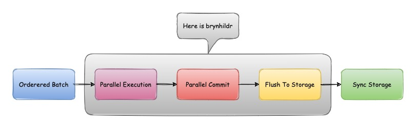
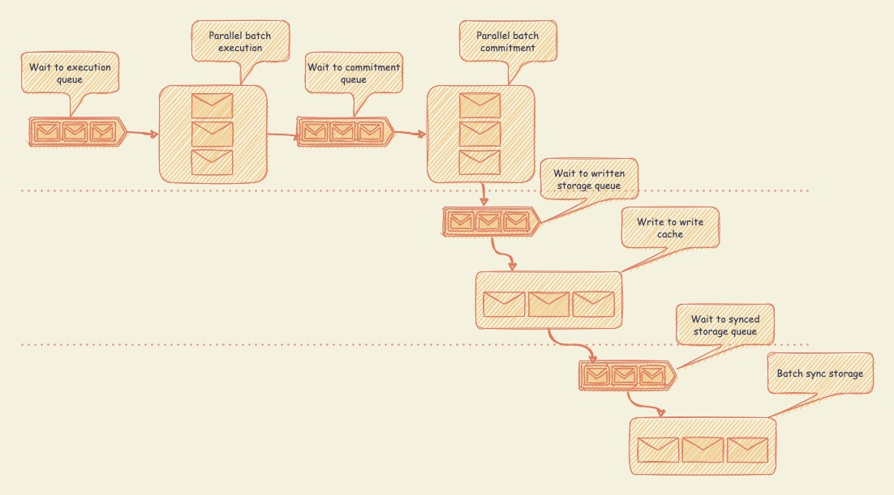

# Architecture

## Brynhildr Pipeline Workflow

The design of Brynhildr is a classical pipeline workflow. There are three core phases: execution phase, commit phase and
write to storage phase. Depend on native go channel mechanism, the pipeline is smoothly. The execution and commit phase,
write to storage phase and sync to storage phase runs parallel.

## AriaLikeScheduler Pipeline Workflow

The all three phases have well-known interface definition, you can implement them by yourself. Of course brynhildr
provides some interesting implementations. Currently, it has
an [Aria: A Fast and Practical Deterministic OLTP Database](http://www.vldb.org/pvldb/vol13/p2047-lu.pdf)
like implementation which provides high concurrency support if transaction conflict is low. It allows all the
transactions parallel execution and commitment.

In future Brynhildr will add more scheduler implementation, furthermore it could collect statistic information from
batches which already finished and try to switch scheduler dynamic.